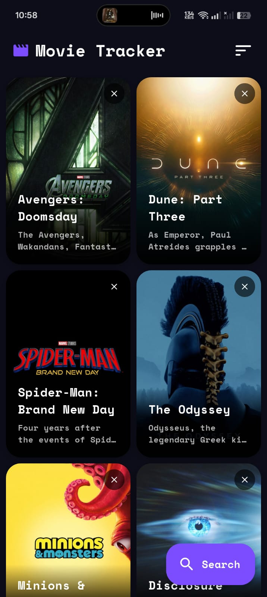
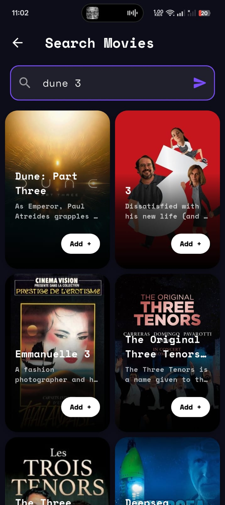
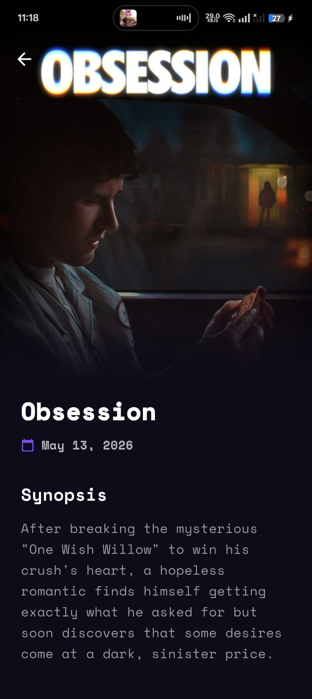
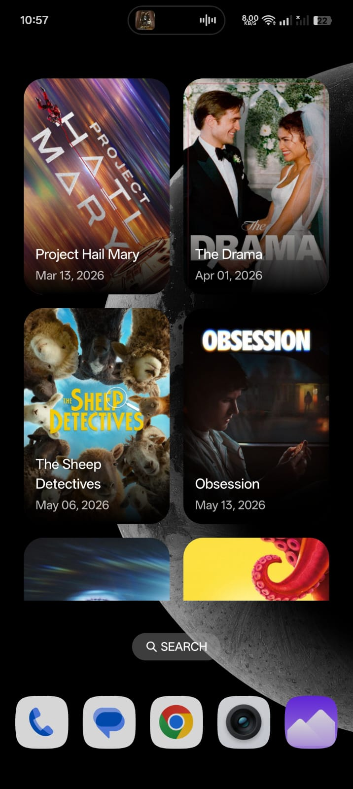

# 🎬 Absolute Cinema

A sleek, modern Flutter application for discovering and tracking movies — powered by the **TMDB API**. Search any movie, save it to your personal list, and keep it on your Android home screen widget.


## ✨ Features

### 🔍 TMDB-Powered Search
- **Search any movie** from the TMDB database in real time
- View detailed movie info — synopsis, release date, poster, and more
- **One-tap add** to save a movie to your personal watchlist

### 📱 Modern Movie Tracker
- **Masonry grid layout** showcasing movie posters in a Pinterest-style feed
- **Movie details screen** with a hero poster, synopsis, and release info
- **Sort your collection** by date (newest / oldest) or name (A–Z / Z–A)
- **Delete movies** with a quick tap

### 🏠 Android Home Screen Widget
- **Live widget** displaying your tracked movies directly on your home screen
- **Auto-sync** — widget updates automatically when movies are added or deleted
- **Quick refresh** button and add-movie shortcut on the widget

### 🎨 Modern Dark Theme
- Deep dark UI (`#0D0D1A`) with a **deep purple accent**
- **Google Fonts (Space Mono)** for a clean, monospaced aesthetic
- Frosted gradient overlays on poster cards
- Smooth animations and rounded, modern components

## 📸 Screenshots

<div align="center">
  <table>
    <tr>
      <td></td>
      <td></td>
      <td></td>
      <td></td>
    </tr>
  </table>
</div>

## 🛠️ Tech Stack

| Layer | Technology |
|---|---|
| Framework | Flutter 3.8.1 / Dart |
| Movie Data | [TMDB API](https://www.themoviedb.org/) |
| Local Storage | SQLite (sqflite) |
| UI Layout | Masonry Grid (flutter_staggered_grid_view) |
| Typography | Google Fonts (Space Mono) |
| Widget | Android Home Screen Widget (home_widget) |

## 🚀 Getting Started

### Prerequisites

- Flutter SDK (>=3.8.1)
- Android Studio or VS Code with Flutter extensions
- A TMDB API key (already configured in the project)

### Installation

1. **Clone the repository**
   ```bash
   git clone https://github.com/yourusername/absolute-cinema.git
   cd absolute-cinema
   ```

2. **Install dependencies**
   ```bash
   flutter pub get
   ```

3. **Run the app**
   ```bash
   flutter run
   ```

### Widget Setup

After installing the app:
1. Long-press on your Android home screen
2. Tap "Widgets"
3. Find "Absolute Cinema" widget
4. Drag it to your home screen
5. Your tracked movies will appear automatically!

## 🎯 Usage

### Searching & Adding a Movie

1. Tap the **Search** button on the home screen
2. Type a movie name — results load from TMDB in real time
3. Tap a result card to view full details
4. Tap **Add +** to save the movie to your list

### Viewing Movie Details

Tap any movie card on the home screen to open a full-screen detail view with:
- Hero poster image
- Release date
- Full synopsis

### Sorting Your Collection

Use the sort icon in the app bar to reorder your movies:
- Date (Newest / Oldest)
- Name (A–Z / Z–A)

### Deleting a Movie

Tap the **✕** button on any movie card to remove it from your list.

## 📁 Project Structure

```
lib/
├── main.dart                  # App entry point
├── models/
│   └── movie.dart             # Movie data model
├── screens/
│   ├── home_screen.dart       # Main masonry grid + sort
│   ├── search_movie_screen.dart   # TMDB search UI
│   ├── movie_details_screen.dart  # Full movie detail view
│   └── add_movie_screen.dart      # Manual movie add (legacy)
├── services/
│   └── tmdb_service.dart      # TMDB API integration
├── db/
│   └── database_helper.dart   # SQLite CRUD operations
└── utils/
    └── widget_sync.dart       # Home screen widget sync
```
